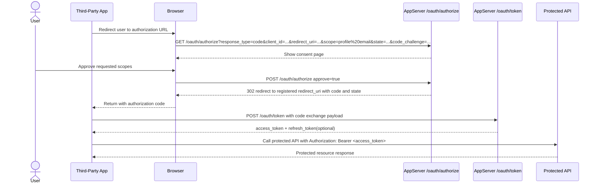

# OAuth app management

Use this page to register OAuth 2.0 client applications for third-party integrations.

## What OAuth is

OAuth 2.0 is an **authorization protocol**. It allows a third-party application to access part of a user's account data or capabilities **without receiving the user's password directly**.

In practical terms:

- You create an OAuth app in this system.
- A third-party app sends the user here for authorization.
- The user approves a set of scopes.
- This system returns the authorization result to the third-party app.
- The app only receives the approved access, not the user's login credentials.

This page is where you control which external apps may request access, which redirect URIs are allowed, and what scopes they can ask for.

## Page purpose

- Create OAuth applications for external websites or tools.
- Configure redirect URIs and basic app metadata.
- Review client IDs, scopes, and secret status.
- Rotate or delete credentials when an integration changes.

## What you will see

### Application list

- Application name and client ID.
- Client type: confidential or public.
- Redirect URI count and recent usage time.
- Secret preview for confidential clients.

### Create / edit dialog

The dialog normally includes:

- **Application name** for identification.
- **Description** for business context.
- **Client type** to decide whether a secret can be safely stored.
- **Redirect URIs** for allowed post-authorization return targets.
- **OAuth scopes** for requested permissions.
- **Homepage / Logo / Policy / ToS URLs** for app identity and compliance.

### Management actions

- Create a new OAuth app.
- Edit redirect URIs, scopes, and URLs.
- Rotate the client secret.
- Delete an unused app.

## Client type: confidential vs public

The client type decides whether the application can safely keep credentials secret.

### Confidential client

Use this for:

- Websites with their own backend
- Server-rendered apps
- Systems that can keep secrets in server-side environment variables

Characteristics:

- The system issues a **client secret**.
- The app is expected to use that secret only on the server side.
- If the secret leaks, another party may impersonate the app in OAuth flows.

Recommendations:

- Store the secret only on the backend.
- Never ship it in browser code, mobile apps, desktop bundles, or public repositories.
- Rotate it immediately if exposure is suspected.

### Public client

Use this for:

- Single-page applications (SPA)
- Mobile apps
- Desktop clients
- Browser extensions

Characteristics:

- A public client must **not rely on a client secret as a security boundary**.
- Any secret embedded in software distributed to end users may be extracted.
- Security depends more on correct redirect URI control, safer authorization flow handling, and narrower scopes.

Simple rule:

- **Confidential client**: can safely store a secret.
- **Public client**: cannot safely store a secret.

## Field and behavior details

### Application name

- Used in management views and may also affect how the app is recognized in the authorization flow.
- Prefer a real product or integration name so users can identify it.

### Description

- Adds context for operators and reviewers.
- Use it to explain what the integration does and who uses it.

### Redirect URI

This is one of the most important OAuth settings.

- After the user approves access, the system only redirects to a **registered redirect URI**.
- The redirect URI in the OAuth request must **match exactly**.
- Differences in protocol, host, port, path, or trailing slash can cause authorization failure.

Recommendations:

- Register separate URIs for development, staging, and production.
- Avoid broad or uncontrolled callback targets.
- Remove old URIs when they are no longer needed.

### Client secret (confidential clients only)

- The full secret may only be shown once after creation or rotation.
- The list normally shows only a preview, not the full plaintext value.
- If the integration loses the secret, the correct action is to rotate it and store the new value securely.

### Homepage, Logo, Policy, and ToS URLs

These fields provide app identity metadata:

- **Homepage URL**: app home page
- **Logo URL**: app icon or logo
- **Policy URL**: privacy policy
- **ToS URL**: terms of service

Typical uses:

- Help users recognize the app during authorization
- Expose compliance and legal information
- Improve trust and clarity in management or consent views

## What OAuth scopes are

OAuth scopes define **which capabilities the third-party app wants to access**.

Core principles:

- **Request only what is needed**
- **Use least privilege**
- **Make the authorization intent understandable**

A scope does not mean “full access after login.” It means “access only to the capabilities approved for that scope.”

## How to read the OAuth Scope reference table

The **OAuth Scope reference table** at the top of the page helps administrators understand each available scope. It normally includes:

- **Scope**: the identifier used directly in authorization requests
- **Description**: a short meaning summary
- **Access**: the kind of data or capability granted
- **Notes**: extra caveats, sensitivity notes, or usage guidance

This table helps answer questions such as:

- Which scopes are safe for common integrations?
- Which scopes are sensitive and should be granted carefully?
- Does a given app actually need the scope it is requesting?

## Common scope meanings

| Scope | Typical meaning | Risk note |
| --- | --- | --- |
| `profile` | Read basic profile data | Usually low-risk baseline access |
| `email` | Read email-related information | Contains personal identity data |
| `notification` | Access notification-related features | May affect notification flows |
| `oauth_client` | Access OAuth client management capabilities | May approach app-level administration |
| `accesskey` | Access access-key related features | May affect programmatic access, higher risk |
| `passkey` | Access passkey-related features | Touches authentication management |
| `two_factor` | Access two-factor related features | High-sensitivity security scope |

Scopes such as `email` and `two_factor` should usually be treated as more sensitive and granted with extra care.

## Recommended setup strategy

### If your integration has a backend

- Prefer a **confidential client**.
- Store the client secret only on the server.
- Register only the redirect URIs you truly use.
- Request only the scopes the business flow requires.

### If your integration is frontend-only or runs on user devices

- Prefer a **public client**.
- Do not assume a client secret can remain private.
- Control redirect URIs and scope selection more strictly.
- Avoid high-sensitivity scopes unless they are truly required.

## Common issues and checks

### Redirect URI mismatch during authorization

Check whether:

- the request URI exactly matches the registered value
- a trailing slash differs
- the port differs
- the wrong environment URI was used

### Full client secret is no longer visible

This is usually expected.

- Full secrets are often shown only once.
- If the value was not saved, rotate the secret and store the new one securely.

### Not sure whether to choose confidential or public

The key question is not feature size. It is:

- **Can the application keep the secret only on a trusted server and never expose it to end users?**

If not, treat it as a public client.

## Common actions

1. Create an app and choose the correct client type.
2. Add every allowed redirect URI exactly as your integration will use it.
3. Copy the client secret immediately if one is issued.
4. Rotate the secret if it may have been exposed.

## How to actually call it

If you are integrating for the first time, think of the flow as four steps:

1. Create an OAuth app in the management page and get a `client_id`. Confidential clients also receive a `client_secret`.
2. Redirect the user to `/oauth/authorize`.
3. After approval, the system redirects back to a registered `redirect_uri` with a temporary `code`.
4. Your backend exchanges that `code` at `/oauth/token` for an `access_token`.

### Step 1: Build the authorization URL

Example authorization request:

```text
GET /oauth/authorize
  ?response_type=code
  &client_id=oc_live_example123
  &redirect_uri=https%3A%2F%2Fexample.com%2Foauth%2Fcallback
  &scope=profile%20email
  &state=csrf-token-123
  &code_challenge=BASE64URL_ENCODED_CHALLENGE
  &code_challenge_method=S256
```

Important parameters:

- `response_type=code`: use the authorization code flow.
- `client_id`: the client ID issued when the app is created on this page.
- `redirect_uri`: must exactly match a registered redirect URI.
- `scope`: a space-delimited scope list.
- `state`: strongly recommended for CSRF protection.
- `code_challenge` / `code_challenge_method`: PKCE is recommended, especially for public clients.

### Step 2: Receive the redirect after user approval

After the user grants access, the system redirects back to your callback, for example:

```text
https://example.com/oauth/callback?code=returned_code&state=csrf-token-123
```

At that point, your app should:

1. Verify that `state` matches the value stored before redirecting.
2. Send the `code` to your backend so the backend can exchange it for tokens.

### Step 3: Exchange the code for an access token

```bash
curl -X POST "https://api.qysyw.cn/oauth/token" \
  -H "Content-Type: application/json" \
  -d '{
    "grant_type": "authorization_code",
    "client_id": "oc_live_example123",
    "client_secret": "oc_secret_example456",
    "code": "returned_code",
    "redirect_uri": "https://example.com/oauth/callback",
    "code_verifier": "pkce-verifier"
  }'
```

### Step 4: Call business APIs with the access token

```bash
curl -X GET "https://api.qysyw.cn/users/profile" \
  -H "Authorization: Bearer <oauth_access_token>"
```

## Minimal TypeScript demo

```ts
const API_BASE_URL = 'https://api.qysyw.cn'

export function buildAuthorizeUrl() {
  const url = new URL('/oauth/authorize', API_BASE_URL)
  url.searchParams.set('response_type', 'code')
  url.searchParams.set('client_id', 'oc_live_example123')
  url.searchParams.set('redirect_uri', 'https://example.com/oauth/callback')
  url.searchParams.set('scope', 'profile email')
  url.searchParams.set('state', crypto.randomUUID())
  url.searchParams.set('code_challenge', 'pkce-challenge')
  url.searchParams.set('code_challenge_method', 'S256')
  return url.toString()
}

export async function exchangeToken(code: string, codeVerifier: string) {
  const response = await fetch(`${API_BASE_URL}/oauth/token`, {
    method: 'POST',
    headers: { 'Content-Type': 'application/json' },
    body: JSON.stringify({
      grant_type: 'authorization_code',
      client_id: 'oc_live_example123',
      client_secret: 'oc_secret_example456',
      code,
      redirect_uri: 'https://example.com/oauth/callback',
      code_verifier: codeVerifier,
    }),
  })

  return response.json()
}
```

## Python demo

```python
import requests

payload = {
    "grant_type": "authorization_code",
    "client_id": "oc_live_example123",
    "client_secret": "oc_secret_example456",
    "code": "returned_code",
    "redirect_uri": "https://example.com/oauth/callback",
    "code_verifier": "pkce-verifier",
}

response = requests.post(
    "https://api.qysyw.cn/oauth/token",
    json=payload,
    timeout=15,
)
response.raise_for_status()
print(response.json())
```

## Review workflow notes

OAuth apps are no longer always “create and use immediately”. In many cases they move through a review workflow. Both app owners and platform operators should understand this.

### Status meanings

| Status | Meaning | Usable in the real OAuth flow |
| --- | --- | --- |
| `draft` | Draft, not submitted yet | No |
| `pending` | Submitted and waiting for review | No |
| `approved` | Review passed | Yes |
| `rejected` | Rejected and must be revised | No |

### Review-related notes

- The app can only be used in the actual authorization flow after it reaches `approved`.
- After rejection, the owner should revise the app based on the review comment and resubmit it.
- If an approved or rejected app is edited again, it will typically return to `draft` and wait for re-submission.
- Review comments should be visible to both administrators and app owners so fixes can be made efficiently.

## Redirect URI configuration guidance

This section should be very explicit because it is one of the most common OAuth integration failure points.

### Recommended practice

- Register development, staging, and production URIs separately
- Use complete and controlled HTTPS URLs
- Match protocol, host, port, and path exactly
- Remove obsolete callback URLs quickly

### Common mistakes

- Missing trailing slash
- Wrong domain
- Mixing test and production environments
- Using a frontend page URL instead of the actual backend callback handler

## Recommended next additions for the docs site

To make the docs feel like a real documentation center instead of plain notes, consider adding:

1. Authorization-page screenshots or flow diagrams
2. A full PKCE example
3. Refresh-token examples
4. Scope reference tables with sensitivity notes
5. Troubleshooting checklists for common OAuth errors

## Related pages

- `api-documentation`
- `access-key-management`
- `account-settings`
- `client_id`: the client ID from the management page.
- `redirect_uri`: must exactly match one registered redirect URI.
- `scope`: scopes requested for this authorization, separated by spaces.
- `state`: strongly recommended for CSRF protection and request correlation.
- `code_challenge` and `code_challenge_method`: recommended with PKCE, especially for public clients.

### Step 2: User approval

When the user opens the authorization URL, the system shows:

- the application name
- the requested scopes
- whether consent is required again
- the redirect target that will receive the result

If the user approves, the system redirects back, for example:

```text
https://example.com/oauth/callback?code=AUTH_CODE_123&state=csrf-token-123
```

At that point you should:

- extract the `code`
- verify that the returned `state` matches the value you stored before redirecting the user

### Step 3: Exchange the code for a token

Confidential clients usually do this from the backend:

```bash
curl -X POST "https://your-appserver.example.com/oauth/token" \
  -H "Content-Type: application/json" \
  -d '{
    "grant_type": "authorization_code",
    "code": "AUTH_CODE_123",
    "redirect_uri": "https://example.com/oauth/callback",
    "client_id": "oc_live_example123",
    "client_secret": "oc_secret_xxx",
    "code_verifier": "original-pkce-verifier"
  }'
```

Public clients usually omit `client_secret`, but should still use PKCE:

```bash
curl -X POST "https://your-appserver.example.com/oauth/token" \
  -H "Content-Type: application/json" \
  -d '{
    "grant_type": "authorization_code",
    "code": "AUTH_CODE_123",
    "redirect_uri": "myapp://oauth/callback",
    "client_id": "oc_public_example123",
    "code_verifier": "original-pkce-verifier"
  }'
```

Typical response:

```json
{
  "access_token": "access_token_here",
  "token_type": "Bearer",
  "expires_in": 3600,
  "refresh_token": "refresh_token_here",
  "scope": "profile email"
}
```

### Step 4: Call APIs with the access token

Once you have the token, send it in the `Authorization` header:

```bash
curl "https://your-appserver.example.com/api/some-protected-resource" \
  -H "Authorization: Bearer access_token_here"
```

If the API requires a scope that your token does not have, the request still fails.

In other words:

- OAuth tokens answer “has the third-party app been authorized?”
- internal permission and security checks answer “is this token allowed to do this specific action?”

### Step 5: Refresh the access token after it expires

If the token response includes a `refresh_token`, you can usually obtain a new access token after expiry without forcing the user through consent again every time.

Example:

```bash
curl -X POST "https://your-appserver.example.com/oauth/token" \
  -H "Content-Type: application/json" \
  -d '{
    "grant_type": "refresh_token",
    "refresh_token": "refresh_token_here",
    "client_id": "oc_live_example123",
    "client_secret": "oc_secret_xxx"
  }'
```

Public clients usually omit `client_secret`:

```bash
curl -X POST "https://your-appserver.example.com/oauth/token" \
  -H "Content-Type: application/json" \
  -d '{
    "grant_type": "refresh_token",
    "refresh_token": "refresh_token_here",
    "client_id": "oc_public_example123"
  }'
```

You can think of it like this:

- `access_token`: a short-lived pass
- `refresh_token`: a credential that can request a new pass when policy allows it

If the refresh token is expired, revoked, or does not match the client, refresh will fail and you usually need to restart the authorization flow.

### Step 6: Revoke tokens when they are no longer needed

When a user disconnects an integration, removes an app, or you suspect token exposure, call the revoke endpoint proactively.

Example:

```bash
curl -X POST "https://your-appserver.example.com/oauth/revoke" \
  -H "Content-Type: application/json" \
  -d '{
    "token": "refresh_token_here",
    "client_id": "oc_live_example123",
    "client_secret": "oc_secret_xxx",
    "token_type_hint": "refresh_token"
  }'
```

Public clients can omit `client_secret`:

```bash
curl -X POST "https://your-appserver.example.com/oauth/revoke" \
  -H "Content-Type: application/json" \
  -d '{
    "token": "access_token_here",
    "client_id": "oc_public_example123",
    "token_type_hint": "access_token"
  }'
```

A successful response usually looks like this:

```json
{
  "revoked": true
}
```

Common times to revoke tokens:

- the user clicks “disconnect” in your product
- the user deletes the OAuth app or disables the integration
- you suspect token or secret leakage
- you want old tokens to stop working immediately

## Full flow at a glance



## Easy-to-miss integration details

### 1. Redirect URI must match exactly

It is not enough to be on the same domain. These parts must match exactly:

- scheme
- host
- port
- path
- trailing slash

### 2. Never ship a confidential client secret to the frontend

If your app runs in a browser, mobile package, or desktop client distributed to users, do not treat `client_secret` as secret there.

### 3. Always send state when possible

This helps you confirm:

- the flow was initiated by your app
- the callback was not swapped or tampered with

### 4. Public clients should use PKCE

Even without a `client_secret`, use:

- `code_challenge`
- `code_challenge_method`
- `code_verifier`

### 5. A granted scope does not bypass internal security rules

Sensitive capabilities may still be limited by:

- account permissions
- security validation
- two-factor or high-risk protection policies

## Notes

- Public clients do not use a client secret.
- Confidential client secrets are sensitive and may only be shown once in full.
- Redirect URIs must match exactly during OAuth authorization.
- Scopes should follow the least-privilege principle.
- High-sensitivity scopes should only be granted to trusted integrations with a clear need.

## Related pages

- `account-settings`
- `api-documentation`
