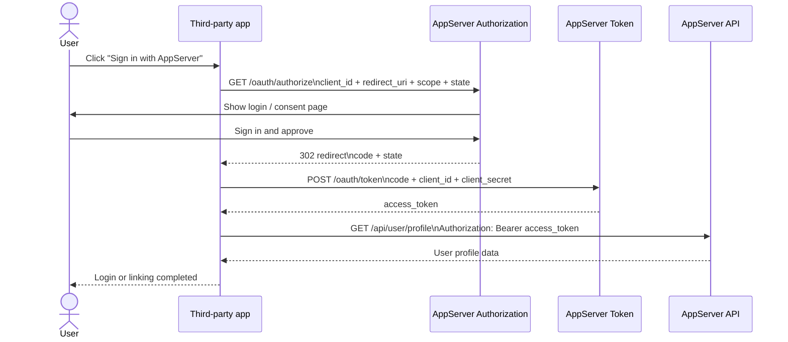
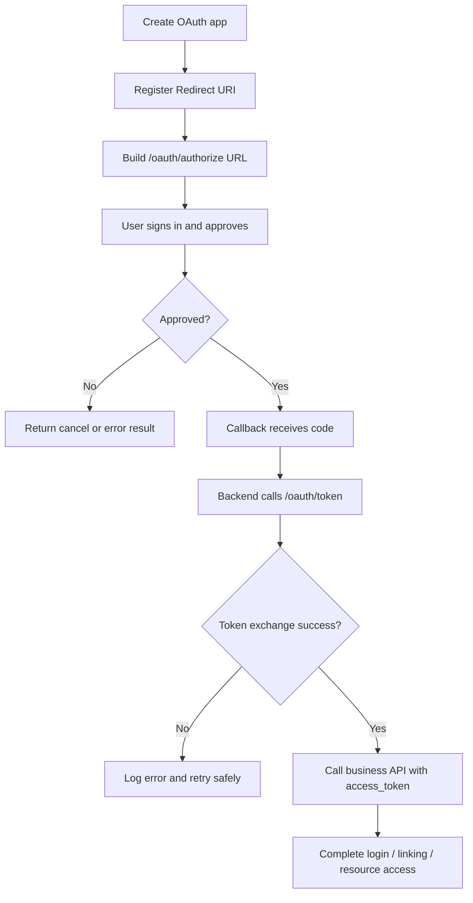

# OAuth Demo

This page provides a complete minimal authorization-code demo, including diagrams plus Node and Python templates.

If you would rather start from a full runnable project instead of assembling the snippets manually, start with `ServerSDK/demos/oauth/node/`, or pick a language-specific sample from `ServerSDK/sdks/oauth/*`.

<div class="docs-jump-grid">
  <a class="docs-jump-card" href="/en/node-sdk">
    <span class="docs-jump-eyebrow">Direct API calls</span>
    <strong>Node SDK</strong>
    <span>Use this if you only need server-to-server API calls and do not need OAuth login.</span>
  </a>
  <a class="docs-jump-card" href="/en/python-sdk">
    <span class="docs-jump-eyebrow">Direct API calls</span>
    <strong>Python SDK</strong>
    <span>Use this when the integrator is Python and only needs direct API access.</span>
  </a>
  <a class="docs-jump-card current" href="/en/oauth-demo">
    <span class="docs-jump-eyebrow">Current page</span>
    <strong>OAuth Demo</strong>
    <span>This page covers standard authorization-code flow, PKCE, callback handling, and minimal runnable demos.</span>
  </a>
</div>

## OAuth sequence diagram



## OAuth flowchart



## Node minimal OAuth demo

### Suggested structure

```text
ServerSDK/demos/oauth/node/
├─ package.json
├─ .env
└─ src/server.mjs
```

### `package.json`

```json
{
  "name": "quyan-oauth-demo-node",
  "private": true,
  "type": "module",
  "scripts": {
    "dev": "node index.js"
  },
  "dependencies": {
    "dotenv": "^16.4.5",
    "express": "^4.21.2"
  }
}
```

### `.env`

```env
PORT=3000
APP_BASE_URL=http://localhost:3000
APPSERVER_BASE_URL=http://localhost:10001
CLIENT_ID=oc_live_your_client_id
CLIENT_SECRET=your_client_secret
REDIRECT_URI=http://localhost:3000/oauth/callback
SCOPE=profile email
```

### `index.js`

```js
import "dotenv/config";
import express from "express";

const app = express();
const port = Number(process.env.PORT || 3000);
const appBaseUrl = process.env.APP_BASE_URL;
const apiBaseUrl = process.env.APPSERVER_BASE_URL;
const clientId = process.env.CLIENT_ID;
const clientSecret = process.env.CLIENT_SECRET;
const redirectUri = process.env.REDIRECT_URI;
const scope = process.env.SCOPE || "profile";

app.get("/", (_req, res) => {
  res.type("html").send(`
    <h1>OAuth Demo</h1>
    <a href="/login">Use AppServer Login</a>
  `);
});

app.get("/login", (_req, res) => {
  const state = crypto.randomUUID();
  const authorizeUrl = new URL("/oauth/authorize", apiBaseUrl);
  authorizeUrl.searchParams.set("response_type", "code");
  authorizeUrl.searchParams.set("client_id", clientId);
  authorizeUrl.searchParams.set("redirect_uri", redirectUri);
  authorizeUrl.searchParams.set("scope", scope);
  authorizeUrl.searchParams.set("state", state);

  res.redirect(authorizeUrl.toString());
});

app.get("/oauth/callback", async (req, res) => {
  const code = String(req.query.code || "");

  if (!code) {
    res.status(400).json({ error: "missing_code", query: req.query });
    return;
  }

  const tokenResponse = await fetch(new URL("/oauth/token", apiBaseUrl), {
    method: "POST",
    headers: {
      "Content-Type": "application/json",
    },
    body: JSON.stringify({
      grant_type: "authorization_code",
      code,
      client_id: clientId,
      client_secret: clientSecret,
      redirect_uri: redirectUri,
    }),
  });

  const tokenPayload = await tokenResponse.json();
  const accessToken =
    tokenPayload?.data?.accessToken || tokenPayload?.access_token;

  if (!accessToken) {
    res.status(502).json({ error: "token_exchange_failed", tokenPayload });
    return;
  }

  const profileResponse = await fetch(
    new URL("/api/user/profile", apiBaseUrl),
    {
      headers: {
        Authorization: `Bearer ${accessToken}`,
      },
    },
  );

  const profilePayload = await profileResponse.json();

  res.json({
    message: "oauth_success",
    tokenPayload,
    profilePayload,
  });
});

app.listen(port, () => {
  console.log(`Demo server ready at ${appBaseUrl}`);
});
```

## Python minimal OAuth demo

### Suggested structure

```text
ServerSDK/sdks/oauth/python/
├─ requirements.txt
├─ .env
└─ app.py
```

### `requirements.txt`

```txt
flask==3.0.3
python-dotenv==1.0.1
requests==2.32.3
```

### `.env`

```env
PORT=3000
APP_BASE_URL=http://localhost:3000
APPSERVER_BASE_URL=http://localhost:10001
CLIENT_ID=oc_live_your_client_id
CLIENT_SECRET=your_client_secret
REDIRECT_URI=http://localhost:3000/oauth/callback
SCOPE=profile email
```

### `app.py`

```python
import os
import secrets
from urllib.parse import urlencode

import requests
from dotenv import load_dotenv
from flask import Flask, jsonify, redirect, request

load_dotenv()

app = Flask(__name__)

PORT = int(os.getenv("PORT", "3000"))
APP_BASE_URL = os.getenv("APP_BASE_URL", f"http://localhost:{PORT}")
APPSERVER_BASE_URL = os.getenv("APPSERVER_BASE_URL", "http://localhost:10001")
CLIENT_ID = os.getenv("CLIENT_ID", "")
CLIENT_SECRET = os.getenv("CLIENT_SECRET", "")
REDIRECT_URI = os.getenv("REDIRECT_URI", f"{APP_BASE_URL}/oauth/callback")
SCOPE = os.getenv("SCOPE", "profile")


@app.get("/")
def home():
    return '<h1>OAuth Demo</h1><a href="/login">Use AppServer Login</a>'


@app.get("/login")
def login():
    state = secrets.token_urlsafe(24)
    query = urlencode(
        {
            "response_type": "code",
            "client_id": CLIENT_ID,
            "redirect_uri": REDIRECT_URI,
            "scope": SCOPE,
            "state": state,
        }
    )
    return redirect(f"{APPSERVER_BASE_URL}/oauth/authorize?{query}")


@app.get("/oauth/callback")
def oauth_callback():
    code = request.args.get("code", "")

    if not code:
        return jsonify({"error": "missing_code", "query": request.args}), 400

    token_response = requests.post(
        f"{APPSERVER_BASE_URL}/oauth/token",
        json={
            "grant_type": "authorization_code",
            "code": code,
            "client_id": CLIENT_ID,
            "client_secret": CLIENT_SECRET,
            "redirect_uri": REDIRECT_URI,
        },
        timeout=15,
    )
    token_payload = token_response.json()

    access_token = (
        token_payload.get("data", {}).get("accessToken")
        or token_payload.get("access_token")
    )
    if not access_token:
        return jsonify({"error": "token_exchange_failed", "tokenPayload": token_payload}), 502

    profile_response = requests.get(
        f"{APPSERVER_BASE_URL}/api/user/profile",
        headers={"Authorization": f"Bearer {access_token}"},
        timeout=15,
    )
    profile_payload = profile_response.json()

    return jsonify(
        {
            "message": "oauth_success",
            "tokenPayload": token_payload,
            "profilePayload": profile_payload,
        }
    )


if __name__ == "__main__":
    app.run(host="0.0.0.0", port=PORT, debug=True)
```

## PKCE example for public clients

If the app is a public client, such as a desktop app, CLI, mobile app, or another environment that should not store `client_secret`, use **Authorization Code + PKCE**.

Key differences:

- send `code_challenge` and `code_challenge_method=S256` to `/oauth/authorize`
- send `code_verifier` to `/oauth/token`
- public clients normally do **not** send `client_secret`

### Node PKCE example

```js
import crypto from "crypto";

function toBase64Url(buffer) {
  return buffer
    .toString("base64")
    .replace(/\+/g, "-")
    .replace(/\//g, "_")
    .replace(/=+$/g, "");
}

function createPkcePair() {
  const codeVerifier = toBase64Url(crypto.randomBytes(32));
  const codeChallenge = toBase64Url(
    crypto.createHash("sha256").update(codeVerifier).digest(),
  );

  return { codeVerifier, codeChallenge, codeChallengeMethod: "S256" };
}

const { codeVerifier, codeChallenge, codeChallengeMethod } = createPkcePair();
const state = crypto.randomUUID();

const authorizeUrl = new URL(
  "/oauth/authorize",
  process.env.APPSERVER_BASE_URL,
);
authorizeUrl.searchParams.set("response_type", "code");
authorizeUrl.searchParams.set("client_id", process.env.CLIENT_ID);
authorizeUrl.searchParams.set("redirect_uri", process.env.REDIRECT_URI);
authorizeUrl.searchParams.set("scope", process.env.SCOPE || "profile email");
authorizeUrl.searchParams.set("state", state);
authorizeUrl.searchParams.set("code_challenge", codeChallenge);
authorizeUrl.searchParams.set("code_challenge_method", codeChallengeMethod);

console.log("Open this URL in the browser:");
console.log(authorizeUrl.toString());

// After the browser redirects back, paste the callback code here.
const code = "paste_callback_code_here";

const tokenResponse = await fetch(
  new URL("/oauth/token", process.env.APPSERVER_BASE_URL),
  {
    method: "POST",
    headers: { "Content-Type": "application/json" },
    body: JSON.stringify({
      grant_type: "authorization_code",
      code,
      client_id: process.env.CLIENT_ID,
      redirect_uri: process.env.REDIRECT_URI,
      code_verifier: codeVerifier,
    }),
  },
);

console.log(await tokenResponse.json());
```

### Python PKCE example

```python
import base64
import hashlib
import os
import secrets
from urllib.parse import urlencode

import requests


def to_base64url(raw: bytes) -> str:
    return base64.urlsafe_b64encode(raw).rstrip(b"=").decode("utf-8")


def create_pkce_pair() -> tuple[str, str]:
    code_verifier = to_base64url(secrets.token_bytes(32))
    code_challenge = to_base64url(hashlib.sha256(code_verifier.encode("utf-8")).digest())
    return code_verifier, code_challenge


code_verifier, code_challenge = create_pkce_pair()
state = secrets.token_urlsafe(24)

authorize_query = urlencode(
    {
        "response_type": "code",
        "client_id": os.getenv("CLIENT_ID", ""),
        "redirect_uri": os.getenv("REDIRECT_URI", ""),
        "scope": os.getenv("SCOPE", "profile email"),
        "state": state,
        "code_challenge": code_challenge,
        "code_challenge_method": "S256",
    }
)

print("Open this URL in the browser:")
print(f"{os.getenv('APPSERVER_BASE_URL', 'http://localhost:10001')}/oauth/authorize?{authorize_query}")

# After the browser redirects back, paste the callback code here.
code = "paste_callback_code_here"

token_response = requests.post(
    f"{os.getenv('APPSERVER_BASE_URL', 'http://localhost:10001')}/oauth/token",
    json={
        "grant_type": "authorization_code",
        "code": code,
        "client_id": os.getenv("CLIENT_ID", ""),
        "redirect_uri": os.getenv("REDIRECT_URI", ""),
        "code_verifier": code_verifier,
    },
    timeout=15,
)

print(token_response.json())
```

### PKCE guidance

- prefer `S256` for public clients, not `plain`
- keep `code_verifier` only in the local active session
- still validate `state`; PKCE does not replace CSRF protection
- if the server can safely store a secret, confidential clients are still simpler for backend-only apps

## Pre-launch checklist

- correct OAuth app type created: confidential or public
- production redirect URI registered
- `client_secret` stored only on the server
- `state` parameter verified
- token exchange failure logging added
- successful user-profile read verified after authorization
- development, staging, and production configs separated

<div class="docs-jump-grid">
  <a class="docs-jump-card" href="/en/node-sdk">
    <span class="docs-jump-eyebrow">Back to direct calls</span>
    <strong>Return to Node SDK</strong>
    <span>Go back if you want the lighter server-to-server template instead of OAuth login.</span>
  </a>
  <a class="docs-jump-card" href="/en/python-sdk">
    <span class="docs-jump-eyebrow">Back to direct calls</span>
    <strong>Return to Python SDK</strong>
    <span>Go back if the Python integration only needs direct API access.</span>
  </a>
</div>
