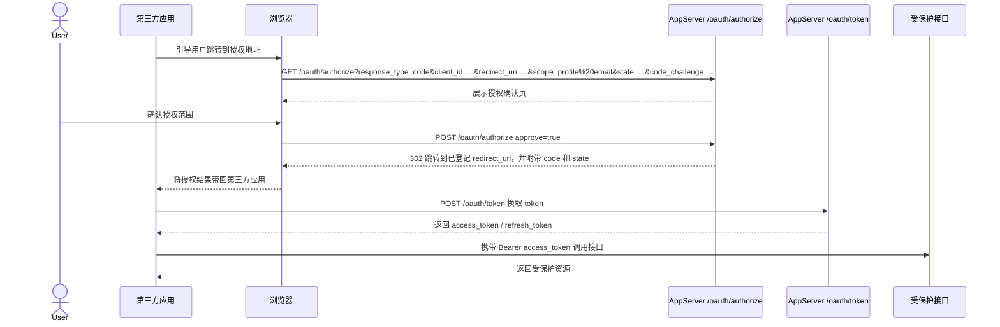

# OAuth 应用管理

此页面用于注册第三方接入所需的 OAuth 2.0 客户端应用。

## OAuth 是什么

OAuth 2.0 是一种**授权协议**，用于让第三方应用在**不直接拿到你的账号密码**的前提下，按授权范围访问你的部分账号数据或功能。

你可以把它理解为：

- 你先在本系统里创建一个 OAuth 应用。
- 第三方系统把用户带到本系统完成授权。
- 用户确认授权范围后，本系统再把授权结果回传给第三方应用。
- 第三方应用后续只拿到被授权的访问能力，而不是你的登录密码。

在本页面中，你管理的是“哪个第三方应用可以申请哪些权限，以及授权完成后允许跳转回哪些地址”。

## 页面用途

- 为外部网站或工具创建 OAuth 应用。
- 配置回调地址和应用基础信息。
- 查看客户端 ID、作用域和密钥状态。
- 在接入信息变更时轮换或删除凭据。

## 你会看到什么

### 应用列表

- 应用名称与客户端 ID。
- 客户端类型：机密应用或公开应用。
- 回调地址数量与最近使用时间。
- 机密应用的密钥预览。

### 创建 / 编辑弹窗

你通常会看到以下配置项：

- **应用名称**：用于区分不同第三方接入。
- **应用描述**：用于补充说明该应用用途。
- **客户端类型**：决定是否可以安全保存客户端密钥。
- **回调地址**：授权成功后允许跳回的地址列表。
- **OAuth Scope**：第三方应用可申请的权限范围。
- **主页 / Logo / Policy / ToS URL**：用于展示应用资料和合规信息。

### 管理动作

- 创建新 OAuth 应用。
- 编辑回调地址、作用域和相关 URL。
- 轮换客户端密钥。
- 删除不再使用的应用。

## 客户端类型：机密应用 vs 公开应用

客户端类型决定你的应用能否安全保存凭据。

### 机密应用（Confidential）

适用于：

- 有自己后端服务的网站
- 服务端渲染应用
- 可以把密钥保存在服务器环境变量中的系统

特点：

- 系统会为它签发 **Client Secret（客户端密钥）**。
- 它可以在服务端安全地使用该密钥。
- 如果密钥泄露，其他人可能冒充该应用发起授权流程。

建议：

- 只把密钥保存在服务端。
- 不要把密钥打包进前端代码、移动端 App、浏览器扩展或公开仓库。
- 如果怀疑泄露，应立即轮换密钥。

### 公开应用（Public）

适用于：

- 纯前端单页应用（SPA）
- 移动端 App
- 桌面客户端
- 浏览器插件

特点：

- **不会**依赖客户端密钥作为保密手段。
- 因为这类应用部署到用户设备上，任何内置密钥都可能被提取。
- 这类应用通常更依赖安全回调地址、授权码流程配套机制以及更小范围的权限申请。

简单理解：

- **机密应用**：能安全保管密钥。
- **公开应用**：不能安全保管密钥，因此不要把密钥当成安全边界。

## 各字段和行为说明

### 应用名称

- 用于管理页面展示，也会影响授权页上的可识别性。
- 建议直接写第三方系统真实名称，方便用户识别来源。

### 应用描述

- 用于补充接入用途。
- 建议说明此应用将用于什么业务、面向哪些用户。

### 回调地址（Redirect URI）

这是 OAuth 中最关键的配置之一。

- 用户授权成功后，系统只会跳转到**已登记的回调地址**。
- 回调地址必须和实际发起授权请求时填写的地址**完全一致**。
- 协议、域名、端口、路径、尾部斜杠不一致，都可能导致授权失败。

建议：

- 每个环境分开登记，例如开发、测试、生产分别配置。
- 不要填写过于宽泛或不受控制的地址。
- 下线旧回调地址后应及时删除。

### 客户端密钥（仅机密应用）

- 创建机密应用后，系统可能只在首次创建或轮换后完整展示一次密钥。
- 后续列表里通常只显示预览值，无法再次看到完整明文。
- 如果接入方丢失密钥，正确做法是**重新轮换**，而不是尝试找回旧值。

### 主页、Logo、Policy、ToS URL

这些字段用于补充应用资料：

- **Homepage URL**：应用主页
- **Logo URL**：应用图标地址
- **Policy URL**：隐私政策地址
- **ToS URL**：服务条款地址

它们的典型作用包括：

- 帮助最终用户识别授权来源
- 提供合规信息
- 让授权页面或管理页面展示更完整的应用信息

## OAuth Scope 是什么

OAuth Scope 用于描述“第三方应用希望访问哪些能力”。

它的核心原则是：

- **按需申请**：只申请真正需要的范围。
- **最小授权**：不要一次开放过多权限。
- **用户可理解**：范围名称应当和实际访问能力一致。

Scope 不是“登录成功就自动拥有全部权限”，而是“授权成功后，仅允许使用被批准的那部分能力”。

## OAuth Scope 说明表怎么看

页面顶部的 **OAuth Scope 说明表** 用来帮助管理员理解每个范围的含义。该表通常包含：

- **Scope**：范围标识符，授权请求时会直接用到。
- **Description**：该范围的大致作用。
- **Access**：授予后允许访问的数据或功能类型。
- **Notes**：额外限制、敏感性提醒或使用建议。

这张表并不只是展示名称，而是帮助你判断：

- 哪些 scope 可以安全开放给普通接入方
- 哪些 scope 属于敏感权限，应谨慎授予
- 某个第三方应用是否真的需要申请对应能力

## 常见 Scope 含义

以下是页面中常见范围的理解方式：

| Scope | 典型含义 | 风险提示 |
| --- | --- | --- |
| `profile` | 读取基础资料 | 通常是低风险基础授权 |
| `email` | 读取邮箱相关信息 | 涉及个人身份信息，较敏感 |
| `notification` | 访问通知相关能力 | 可能影响消息读取或通知联动 |
| `oauth_client` | 管理 OAuth 客户端相关能力 | 可能接近应用级管理权限 |
| `accesskey` | 访问 Access Key 相关能力 | 可能涉及程序化访问能力，风险较高 |
| `passkey` | 访问 Passkey 相关能力 | 涉及认证方式管理，需谨慎 |
| `two_factor` | 访问双因素认证相关能力 | 属于高敏感安全范围 |

其中像 `email`、`two_factor` 这类通常会被标记为更敏感的范围，分配时要特别谨慎。

## 推荐配置策略

### 如果你是网站后端接入

- 优先选择**机密应用**。
- 将 Client Secret 只保存在服务端。
- 只登记实际会使用的正式回调地址。
- 只申请当前业务必须的 scope。

### 如果你是前端 App / 移动端接入

- 优先选择**公开应用**。
- 不要假设客户端密钥可以保密。
- 更严格地控制回调地址和权限范围。
- 避免请求高敏感 scope，除非业务确实需要。

## 常见错误与排查

### 授权后提示回调地址不匹配

重点检查：

- 是否与登记值完全一致
- 是否多了或少了 `/`
- 是否端口不同
- 是否使用了错误的环境地址

### 创建后找不到完整客户端密钥

这通常是正常行为。

- 机密应用的完整密钥往往只展示一次。
- 如果未保存，应重新轮换生成新的密钥。

### 不确定该选机密还是公开

判断标准不是“功能强不强”，而是：

- **你的应用能不能把密钥只保存在服务端且不暴露给用户？**

如果不能，就应该按公开应用处理。

## 常见操作

1. 创建应用时选择正确的客户端类型。
2. 将所有允许的回调地址按实际接入地址逐条填写。
3. 如果系统下发了客户端密钥，请立即复制并保存。
4. 如怀疑密钥泄露，请立即轮换密钥。

## 具体怎么调用

如果你是第一次接入，可以直接把流程理解成 4 步：

1. 在“OAuth 应用管理”页面创建应用，拿到 `client_id`，如果是机密应用还会拿到 `client_secret`。
2. 让用户跳转到授权地址 `/oauth/authorize`。
3. 用户同意后，系统会把用户带回你登记过的回调地址，并附带一个临时 `code`。
4. 你的服务端再把这个 `code` 发给 `/oauth/token`，换取 `access_token`。

### 第一步：拼授权地址

授权地址示例：

```text
GET /oauth/authorize
  ?response_type=code
  &client_id=oc_live_example123
  &redirect_uri=https%3A%2F%2Fexample.com%2Foauth%2Fcallback
  &scope=profile%20email
  &state=csrf-token-123
  &code_challenge=BASE64URL_ENCODED_CHALLENGE
  &code_challenge_method=S256
```

关键参数说明：

- `response_type=code`：使用授权码模式。
- `client_id`：你在本页创建应用后拿到的客户端 ID。
- `redirect_uri`：必须与已登记回调地址完全一致。
- `scope`：空格分隔的权限范围列表。
- `state`：强烈建议携带，用于防 CSRF。
- `code_challenge` / `code_challenge_method`：推荐开启 PKCE，尤其是公开应用。

### 第二步：用户同意授权后接收回调

授权成功后，系统会把用户带回你的回调地址，例如：

```text
https://example.com/oauth/callback?code=returned_code&state=csrf-token-123
```

这时你要做两件事：

1. 校验 `state` 是否与你发起授权时保存的一致。
2. 把 `code` 发送给你的后端，由后端换取 token。

### 第三步：后端换取 access token

```bash
curl -X POST "https://api.qysyw.cn/oauth/token" \
  -H "Content-Type: application/json" \
  -d '{
    "grant_type": "authorization_code",
    "client_id": "oc_live_example123",
    "client_secret": "oc_secret_example456",
    "code": "returned_code",
    "redirect_uri": "https://example.com/oauth/callback",
    "code_verifier": "pkce-verifier"
  }'
```

### 第四步：携带 access token 调业务接口

```bash
curl -X GET "https://api.qysyw.cn/users/profile" \
  -H "Authorization: Bearer <oauth_access_token>"
```

## TypeScript 最小 Demo

```ts
const API_BASE_URL = 'https://api.qysyw.cn'

export function buildAuthorizeUrl() {
  const url = new URL('/oauth/authorize', API_BASE_URL)
  url.searchParams.set('response_type', 'code')
  url.searchParams.set('client_id', 'oc_live_example123')
  url.searchParams.set('redirect_uri', 'https://example.com/oauth/callback')
  url.searchParams.set('scope', 'profile email')
  url.searchParams.set('state', crypto.randomUUID())
  url.searchParams.set('code_challenge', 'pkce-challenge')
  url.searchParams.set('code_challenge_method', 'S256')
  return url.toString()
}

export async function exchangeToken(code: string, codeVerifier: string) {
  const response = await fetch(`${API_BASE_URL}/oauth/token`, {
    method: 'POST',
    headers: { 'Content-Type': 'application/json' },
    body: JSON.stringify({
      grant_type: 'authorization_code',
      client_id: 'oc_live_example123',
      client_secret: 'oc_secret_example456',
      code,
      redirect_uri: 'https://example.com/oauth/callback',
      code_verifier: codeVerifier,
    }),
  })

  return response.json()
}
```

## Python Demo

```python
import requests

payload = {
    "grant_type": "authorization_code",
    "client_id": "oc_live_example123",
    "client_secret": "oc_secret_example456",
    "code": "returned_code",
    "redirect_uri": "https://example.com/oauth/callback",
    "code_verifier": "pkce-verifier",
}

response = requests.post(
    "https://api.qysyw.cn/oauth/token",
    json=payload,
    timeout=15,
)
response.raise_for_status()
print(response.json())
```

## 审核流转说明

现在的 OAuth 应用通常不仅是“创建完就能用”，而是会经历审核状态流转。对接方和平台管理员都应了解这一点。

### 状态含义

| 状态 | 含义 | 可否用于正式 OAuth 流程 |
| --- | --- | --- |
| `draft` | 草稿，尚未提交审核 | 不可 |
| `pending` | 已提交，等待审核 | 不可 |
| `approved` | 已通过审核 | 可以 |
| `rejected` | 被拒绝，需修改后重新提交 | 不可 |

### 审核相关注意点

- 应用只有在 `approved` 后才能被正式用于授权流程。
- 被拒绝后，应用所有者应根据审核意见修改资料后重新提交。
- 已通过或已拒绝的应用一旦再次编辑，通常会回到 `draft`，等待重新提交。
- 管理员侧可以看到审核理由，应用所有者也应能看到审核意见，便于整改。

## Redirect URI 配置建议

建议把这一部分写得非常具体，因为这是 OAuth 接入最容易出问题的地方。

### 推荐做法

- 开发环境、测试环境、生产环境分开登记
- 使用完整且可控的 HTTPS 地址
- 精确到协议、域名、端口、路径
- 下线旧地址后及时删除

### 典型错误

- 少了尾部 `/`
- 域名写错
- 测试环境和生产环境混用
- 前端页面地址和后端回调处理地址不一致

## 文档站建议补齐的内容

为了让文档“像文档”，而不是“像备注”，建议后续继续补：

1. OAuth 授权页截图或流程图
2. 完整 PKCE 示例
3. 刷新 token 示例
4. Scope 对照表与敏感范围说明
5. 错误码排查清单

## 相关页面

- `api-documentation`
- `access-key-management`
- `account-settings`

- `response_type=code`：表示你要走授权码模式。
- `client_id`：你在管理页创建应用后获得的客户端 ID。
- `redirect_uri`：必须和管理页里登记的某一项完全一致。
- `scope`：本次希望申请的权限范围，多个用空格分隔。
- `state`：建议一定带上，用来防止 CSRF，也方便你在回调时核对请求来源。
- `code_challenge` / `code_challenge_method`：建议配合 PKCE 使用，尤其是公开应用。

### 第二步：用户授权

用户访问授权地址后，系统会展示：

- 应用名称
- 申请的 scope
- 是否需要重新确认授权
- 回调地址对应的跳转目标

如果用户同意，系统会重定向到你登记的回调地址，例如：

```text
https://example.com/oauth/callback?code=AUTH_CODE_123&state=csrf-token-123
```

这时你要做两件事：

- 取出 `code`
- 校验返回的 `state` 是否和你发起授权前保存的一致

### 第三步：用 code 换 token

机密应用通常由后端发起：

```bash
curl -X POST "https://your-appserver.example.com/oauth/token" \
  -H "Content-Type: application/json" \
  -d '{
    "grant_type": "authorization_code",
    "code": "AUTH_CODE_123",
    "redirect_uri": "https://example.com/oauth/callback",
    "client_id": "oc_live_example123",
    "client_secret": "oc_secret_xxx",
    "code_verifier": "original-pkce-verifier"
  }'
```

公开应用通常没有 `client_secret`，但仍建议使用 PKCE：

```bash
curl -X POST "https://your-appserver.example.com/oauth/token" \
  -H "Content-Type: application/json" \
  -d '{
    "grant_type": "authorization_code",
    "code": "AUTH_CODE_123",
    "redirect_uri": "myapp://oauth/callback",
    "client_id": "oc_public_example123",
    "code_verifier": "original-pkce-verifier"
  }'
```

典型返回结果：

```json
{
  "access_token": "access_token_here",
  "token_type": "Bearer",
  "expires_in": 3600,
  "refresh_token": "refresh_token_here",
  "scope": "profile email"
}
```

### 第四步：携带 access token 调用接口

拿到 token 后，请把它放在 `Authorization` 请求头中：

```bash
curl "https://your-appserver.example.com/api/some-protected-resource" \
  -H "Authorization: Bearer access_token_here"
```

如果接口需要特定 scope，但你的令牌没有对应授权，调用仍会失败。

也就是说：

- OAuth token 解决的是“第三方应用是否被授权”
- 站内权限与安全校验决定的是“这个 token 最终能不能做这件事”

### 第五步：access token 过期后用 refresh token 续期

如果你的返回结果里带有 `refresh_token`，通常可以在 access token 过期后继续换新 token，而不需要每次都让用户重新点一次授权。

示例：

```bash
curl -X POST "https://your-appserver.example.com/oauth/token" \
  -H "Content-Type: application/json" \
  -d '{
    "grant_type": "refresh_token",
    "refresh_token": "refresh_token_here",
    "client_id": "oc_live_example123",
    "client_secret": "oc_secret_xxx"
  }'
```

如果是公开应用，通常不需要传 `client_secret`：

```bash
curl -X POST "https://your-appserver.example.com/oauth/token" \
  -H "Content-Type: application/json" \
  -d '{
    "grant_type": "refresh_token",
    "refresh_token": "refresh_token_here",
    "client_id": "oc_public_example123"
  }'
```

可以把它理解成：

- `access_token`：短期通行证
- `refresh_token`：在规则允许时，用来换新通行证的凭证

如果 refresh token 已失效、被撤销、或客户端信息不匹配，续期会失败，这时通常要重新走授权流程。

### 第六步：不再需要时主动撤销 token

当用户解绑应用、退出第三方登录关系、或你怀疑 token 泄露时，建议主动调用撤销接口。

示例：

```bash
curl -X POST "https://your-appserver.example.com/oauth/revoke" \
  -H "Content-Type: application/json" \
  -d '{
    "token": "refresh_token_here",
    "client_id": "oc_live_example123",
    "client_secret": "oc_secret_xxx",
    "token_type_hint": "refresh_token"
  }'
```

公开应用可省略 `client_secret`：

```bash
curl -X POST "https://your-appserver.example.com/oauth/revoke" \
  -H "Content-Type: application/json" \
  -d '{
    "token": "access_token_here",
    "client_id": "oc_public_example123",
    "token_type_hint": "access_token"
  }'
```

成功时通常会得到类似结果：

```json
{
  "revoked": true
}
```

什么时候应该撤销：

- 用户在你的系统里点击“解除授权”
- 用户删除 OAuth 应用或停用集成
- 你检测到密钥或 token 疑似泄露
- 你希望立即让旧 token 失效

## 一张图看完整流程



## 接入时最容易忽略的点

### 1. 回调地址必须完全一致

不是“同域名就行”，而是要逐项一致：

- 协议
- 域名
- 端口
- 路径
- 尾部斜杠

### 2. 不要把机密应用的密钥放进前端

如果你的应用运行在浏览器、移动端、桌面端，用户都能拿到包体内容，那就不要把 `client_secret` 当成秘密。

### 3. 推荐始终带上 state

这样你在回调时能确认：

- 这是不是你自己发起的授权流程
- 用户回来时有没有被第三方恶意串改流程

### 4. 公开应用推荐配合 PKCE

即使没有 `client_secret`，也应尽量使用：

- `code_challenge`
- `code_challenge_method`
- `code_verifier`

### 5. scope 通过了，不代表一定能绕过站内权限

某些敏感能力依然会继续受：

- 账户权限控制
- 安全校验
- 双因素或高风险校验策略

## 说明

- 公开应用不使用客户端密钥。
- 机密应用的客户端密钥属于敏感信息，完整明文可能只展示一次。
- OAuth 授权时回调地址必须与已登记值完全一致。
- Scope 应遵循最小授权原则，避免过度开放。
- 高敏感 scope 应仅授予确有需要的可信接入方。

## 相关页面

- `account-settings`
- `api-documentation`
