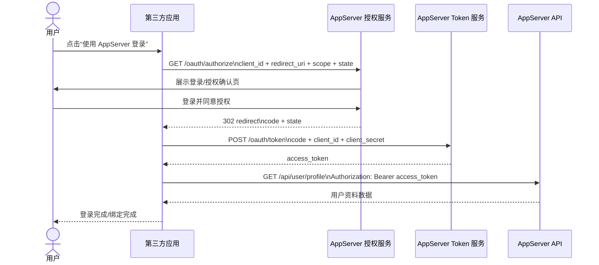
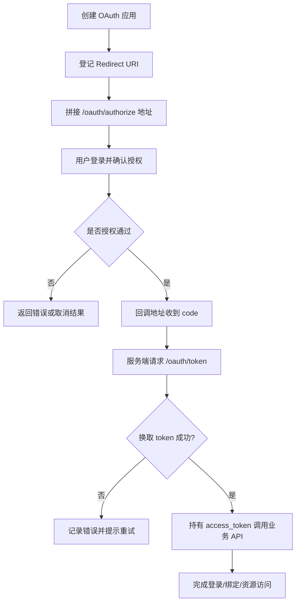

# OAuth Demo

这页提供完整的 OAuth 授权码模式最小 demo，包括时序图、流程图、Node 模板和 Python 模板。

<div class="docs-jump-grid">
  <a class="docs-jump-card" href="/zh-CN/node-sdk">
    <span class="docs-jump-eyebrow">直接调 API</span>
    <strong>Node SDK</strong>
    <span>如果你只是从 Node 服务端调业务 API，不需要 OAuth 登录，可直接用这里的最小模板。</span>
  </a>
  <a class="docs-jump-card" href="/zh-CN/python-sdk">
    <span class="docs-jump-eyebrow">直接调 API</span>
    <strong>Python SDK</strong>
    <span>如果你是 Python 接入方，只做服务间调用，可跳到 Python 模板。</span>
  </a>
  <a class="docs-jump-card current" href="/zh-CN/oauth-demo">
    <span class="docs-jump-eyebrow">当前页</span>
    <strong>OAuth Demo</strong>
    <span>这里聚合标准授权码流程、PKCE、回调处理与最小可跑通示例。</span>
  </a>
</div>

## OAuth 时序图



## OAuth 流程图



## Node 最小 OAuth Demo

### 目录建议

```text
node-oauth-demo/
├─ package.json
├─ .env
└─ index.js
```

### `package.json`

```json
{
  "name": "node-oauth-demo",
  "private": true,
  "type": "module",
  "scripts": {
    "dev": "node index.js"
  },
  "dependencies": {
    "dotenv": "^16.4.5",
    "express": "^4.21.2"
  }
}
```

### `.env`

```env
PORT=3000
APP_BASE_URL=http://localhost:3000
APPSERVER_BASE_URL=http://localhost:10001
CLIENT_ID=oc_live_your_client_id
CLIENT_SECRET=your_client_secret
REDIRECT_URI=http://localhost:3000/oauth/callback
SCOPE=profile email
```

### `index.js`

```js
import "dotenv/config";
import express from "express";

const app = express();
const port = Number(process.env.PORT || 3000);
const appBaseUrl = process.env.APP_BASE_URL;
const apiBaseUrl = process.env.APPSERVER_BASE_URL;
const clientId = process.env.CLIENT_ID;
const clientSecret = process.env.CLIENT_SECRET;
const redirectUri = process.env.REDIRECT_URI;
const scope = process.env.SCOPE || "profile";

app.get("/", (_req, res) => {
  res.type("html").send(`
    <h1>OAuth Demo</h1>
    <a href="/login">Use AppServer Login</a>
  `);
});

app.get("/login", (_req, res) => {
  const state = crypto.randomUUID();
  const authorizeUrl = new URL("/oauth/authorize", apiBaseUrl);
  authorizeUrl.searchParams.set("response_type", "code");
  authorizeUrl.searchParams.set("client_id", clientId);
  authorizeUrl.searchParams.set("redirect_uri", redirectUri);
  authorizeUrl.searchParams.set("scope", scope);
  authorizeUrl.searchParams.set("state", state);

  res.redirect(authorizeUrl.toString());
});

app.get("/oauth/callback", async (req, res) => {
  const code = String(req.query.code || "");

  if (!code) {
    res.status(400).json({ error: "missing_code", query: req.query });
    return;
  }

  const tokenResponse = await fetch(new URL("/oauth/token", apiBaseUrl), {
    method: "POST",
    headers: {
      "Content-Type": "application/json",
    },
    body: JSON.stringify({
      grant_type: "authorization_code",
      code,
      client_id: clientId,
      client_secret: clientSecret,
      redirect_uri: redirectUri,
    }),
  });

  const tokenPayload = await tokenResponse.json();
  const accessToken =
    tokenPayload?.data?.accessToken || tokenPayload?.access_token;

  if (!accessToken) {
    res.status(502).json({ error: "token_exchange_failed", tokenPayload });
    return;
  }

  const profileResponse = await fetch(
    new URL("/api/user/profile", apiBaseUrl),
    {
      headers: {
        Authorization: `Bearer ${accessToken}`,
      },
    },
  );

  const profilePayload = await profileResponse.json();

  res.json({
    message: "oauth_success",
    tokenPayload,
    profilePayload,
  });
});

app.listen(port, () => {
  console.log(`Demo server ready at ${appBaseUrl}`);
});
```

## Python 最小 OAuth Demo

### 目录建议

```text
python-oauth-demo/
├─ requirements.txt
├─ .env
└─ app.py
```

### `requirements.txt`

```txt
flask==3.0.3
python-dotenv==1.0.1
requests==2.32.3
```

### `.env`

```env
PORT=3000
APP_BASE_URL=http://localhost:3000
APPSERVER_BASE_URL=http://localhost:10001
CLIENT_ID=oc_live_your_client_id
CLIENT_SECRET=your_client_secret
REDIRECT_URI=http://localhost:3000/oauth/callback
SCOPE=profile email
```

### `app.py`

```python
import os
import secrets
from urllib.parse import urlencode

import requests
from dotenv import load_dotenv
from flask import Flask, jsonify, redirect, request

load_dotenv()

app = Flask(__name__)

PORT = int(os.getenv("PORT", "3000"))
APP_BASE_URL = os.getenv("APP_BASE_URL", f"http://localhost:{PORT}")
APPSERVER_BASE_URL = os.getenv("APPSERVER_BASE_URL", "http://localhost:10001")
CLIENT_ID = os.getenv("CLIENT_ID", "")
CLIENT_SECRET = os.getenv("CLIENT_SECRET", "")
REDIRECT_URI = os.getenv("REDIRECT_URI", f"{APP_BASE_URL}/oauth/callback")
SCOPE = os.getenv("SCOPE", "profile")


@app.get("/")
def home():
    return '<h1>OAuth Demo</h1><a href="/login">Use AppServer Login</a>'


@app.get("/login")
def login():
    state = secrets.token_urlsafe(24)
    query = urlencode(
        {
            "response_type": "code",
            "client_id": CLIENT_ID,
            "redirect_uri": REDIRECT_URI,
            "scope": SCOPE,
            "state": state,
        }
    )
    return redirect(f"{APPSERVER_BASE_URL}/oauth/authorize?{query}")


@app.get("/oauth/callback")
def oauth_callback():
    code = request.args.get("code", "")

    if not code:
        return jsonify({"error": "missing_code", "query": request.args}), 400

    token_response = requests.post(
        f"{APPSERVER_BASE_URL}/oauth/token",
        json={
            "grant_type": "authorization_code",
            "code": code,
            "client_id": CLIENT_ID,
            "client_secret": CLIENT_SECRET,
            "redirect_uri": REDIRECT_URI,
        },
        timeout=15,
    )
    token_payload = token_response.json()

    access_token = (
        token_payload.get("data", {}).get("accessToken")
        or token_payload.get("access_token")
    )
    if not access_token:
        return jsonify({"error": "token_exchange_failed", "tokenPayload": token_payload}), 502

    profile_response = requests.get(
        f"{APPSERVER_BASE_URL}/api/user/profile",
        headers={"Authorization": f"Bearer {access_token}"},
        timeout=15,
    )
    profile_payload = profile_response.json()

    return jsonify(
        {
            "message": "oauth_success",
            "tokenPayload": token_payload,
            "profilePayload": profile_payload,
        }
    )


if __name__ == "__main__":
    app.run(host="0.0.0.0", port=PORT, debug=True)
```

## PKCE 示例（公开客户端）

如果你的应用是公开客户端，例如桌面应用、CLI、移动端或不适合保存 `client_secret` 的前端壳层，建议改用 **Authorization Code + PKCE**。

关键差异：

- `/oauth/authorize` 阶段传 `code_challenge` 和 `code_challenge_method=S256`
- `/oauth/token` 阶段传 `code_verifier`
- 公开客户端通常 **不传** `client_secret`

### Node PKCE 示例

```js
import crypto from "crypto";

function toBase64Url(buffer) {
  return buffer
    .toString("base64")
    .replace(/\+/g, "-")
    .replace(/\//g, "_")
    .replace(/=+$/g, "");
}

function createPkcePair() {
  const codeVerifier = toBase64Url(crypto.randomBytes(32));
  const codeChallenge = toBase64Url(
    crypto.createHash("sha256").update(codeVerifier).digest(),
  );

  return { codeVerifier, codeChallenge, codeChallengeMethod: "S256" };
}

const { codeVerifier, codeChallenge, codeChallengeMethod } = createPkcePair();
const state = crypto.randomUUID();

const authorizeUrl = new URL(
  "/oauth/authorize",
  process.env.APPSERVER_BASE_URL,
);
authorizeUrl.searchParams.set("response_type", "code");
authorizeUrl.searchParams.set("client_id", process.env.CLIENT_ID);
authorizeUrl.searchParams.set("redirect_uri", process.env.REDIRECT_URI);
authorizeUrl.searchParams.set("scope", process.env.SCOPE || "profile email");
authorizeUrl.searchParams.set("state", state);
authorizeUrl.searchParams.set("code_challenge", codeChallenge);
authorizeUrl.searchParams.set("code_challenge_method", codeChallengeMethod);

console.log("Open this URL in the browser:");
console.log(authorizeUrl.toString());

// 用户授权后，你会在回调地址拿到 code
const code = "paste_callback_code_here";

const tokenResponse = await fetch(
  new URL("/oauth/token", process.env.APPSERVER_BASE_URL),
  {
    method: "POST",
    headers: { "Content-Type": "application/json" },
    body: JSON.stringify({
      grant_type: "authorization_code",
      code,
      client_id: process.env.CLIENT_ID,
      redirect_uri: process.env.REDIRECT_URI,
      code_verifier: codeVerifier,
    }),
  },
);

console.log(await tokenResponse.json());
```

### Python PKCE 示例

```python
import base64
import hashlib
import os
import secrets
from urllib.parse import urlencode

import requests


def to_base64url(raw: bytes) -> str:
    return base64.urlsafe_b64encode(raw).rstrip(b"=").decode("utf-8")


def create_pkce_pair() -> tuple[str, str]:
    code_verifier = to_base64url(secrets.token_bytes(32))
    code_challenge = to_base64url(hashlib.sha256(code_verifier.encode("utf-8")).digest())
    return code_verifier, code_challenge


code_verifier, code_challenge = create_pkce_pair()
state = secrets.token_urlsafe(24)

authorize_query = urlencode(
    {
        "response_type": "code",
        "client_id": os.getenv("CLIENT_ID", ""),
        "redirect_uri": os.getenv("REDIRECT_URI", ""),
        "scope": os.getenv("SCOPE", "profile email"),
        "state": state,
        "code_challenge": code_challenge,
        "code_challenge_method": "S256",
    }
)

print("Open this URL in the browser:")
print(f"{os.getenv('APPSERVER_BASE_URL', 'http://localhost:10001')}/oauth/authorize?{authorize_query}")

# 用户授权回调后，把 code 粘过来
code = "paste_callback_code_here"

token_response = requests.post(
    f"{os.getenv('APPSERVER_BASE_URL', 'http://localhost:10001')}/oauth/token",
    json={
        "grant_type": "authorization_code",
        "code": code,
        "client_id": os.getenv("CLIENT_ID", ""),
        "redirect_uri": os.getenv("REDIRECT_URI", ""),
        "code_verifier": code_verifier,
    },
    timeout=15,
)

print(token_response.json())
```

### PKCE 使用建议

- 公开客户端优先使用 `S256`，不要退回 `plain`
- `code_verifier` 只能保存在当前本地会话，不要上传到第三方服务
- `state` 仍然必须校验，PKCE 不能替代 CSRF 防护
- 若服务端应用本身可以安全保存密钥，仍然优先使用机密客户端模式

## 上线前检查表

- 已创建正确类型的 OAuth 应用（机密 / 公开）
- 已登记生产环境回调地址
- 已保存 `client_secret`，且仅保存在服务端
- 已校验 `state` 参数
- 已做好 token 交换失败日志
- 已验证授权成功后的用户资料读取
- 已把开发、测试、生产环境配置分离

<div class="docs-jump-grid">
  <a class="docs-jump-card" href="/zh-CN/node-sdk">
    <span class="docs-jump-eyebrow">回到直连模板</span>
    <strong>返回 Node SDK</strong>
    <span>如果只保留服务端 API 调用，不再做 OAuth 登录，可回到更轻量的模板。</span>
  </a>
  <a class="docs-jump-card" href="/zh-CN/python-sdk">
    <span class="docs-jump-eyebrow">回到直连模板</span>
    <strong>返回 Python SDK</strong>
    <span>如果你是 Python 接入方，只做服务调用，可使用更短的直连方案。</span>
  </a>
</div>
